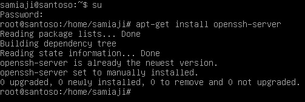
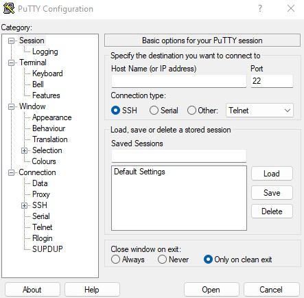
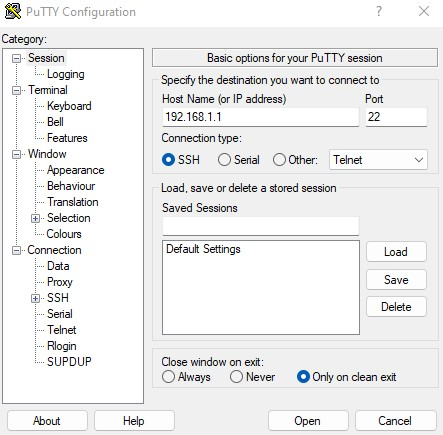
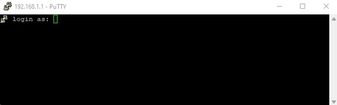
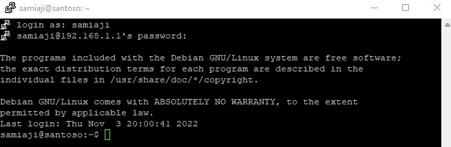
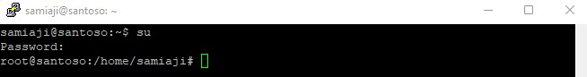

# REMOTE ACCESS

## Instalasi

1. Dalam pembahasan kali ini kita akan menginstall remote access pada server debian yang telah kita install pada VirtualBox. kita akan menginstall salah satu aplikasi remote access yaitu SSH (Secure Shell), aplikasi ini merupakan aplikasi yang sangat familiar dan dianggap lebih aman dalam transfer data melalui jaringan. Untuk menginstallnya ketikkan perintah apt-get install openssh-server dan jika berhasil akan tampil seperti gambar dibawah ini.

## Konfigurasi

2. Sebetulnya dengan menginstall openssh kita sudah dapat menggunakannya dengan menggunakan port 22, tetapi jika ingin mengkonfigurasi ssh server tersebut, kalian bisa mengeditnya pada file sshd_config yang merupakan file konfigurasi utama pada ssh server. Pada file tersebut kita bisa mengubah port yang digunakan. Namun pada pembahasan ini kita tidak akan mengubah settingan port maka akan kita biarkan dengan menggunakan port 22.

## Pengujian

3. Dalam pembahasan ini pengujian ssh server akan dilakukan dari computer client, dimana computer client ini menggunakan system operasi windows, untuk itu kita membutuhkan aplikasi tambahan yaitu Putty, kalian bisa mendownloadnya di link berikut https://www.putty.org/ . Jika selesai mendownload silahkan kalian install dan setelah selesai akan Nampak seperti gambar dibawah ini.

4. Setelah aplikasi berhasil kita download dan install, kita akan memasukkan alamat IP server yang kita gunakan dan juga dengan menggunakan port 22 seperti pada gambar dibawah ini.

5. Setelah itu kalian klik open. Untuk pertama kali login akan muncul pesan peringatan Potential Security Breach, silahkan kalian klik Yes. Jika berhasil maka computer berhasil kita remote melalui aplikasi putty.

6. Setelah muncul gambar seperti di atas, kalian masukkan username dan password seperti pada saat kalian login ke dalam server debian. Dan silahkan masuk juga ke dalam system root dengan mengetikkan perintah su dan masukkan password root kalian.

